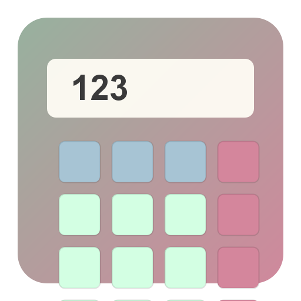

# 🧮 JavaFX Calculator

Modern ve özellik zengin bilimsel hesap makinesi. JavaFX ile geliştirilmiştir.



## ✨ Özellikler

- ✅ **Temel İşlemler**: Toplama, çıkarma, çarpma, bölme
- 🔬 **Bilimsel Fonksiyonlar**: sin, cos, tan, sqrt, ln, log, abs, faktöriyel
- 🔢 **Sabitler**: π (pi), e (Euler sayısı)
- 💾 **Bellek Fonksiyonları**: MC, MR, M+, M-
- 📜 **Geçmiş**: Tüm hesaplamalarınızı kaydedin ve görüntüleyin
- 🎨 **Modern Tasarım**: Ghibli-inspired pastel tema
- 🖥️ **Responsive UI**: Yeniden boyutlandırılabilir arayüz

## 🚀 Kullanım

### Windows İçin Hazır Uygulama (.exe)

**Java kurmadan kullanabilirsiniz!**

1. [Releases](../../releases) sayfasından `Calculator-Windows-v1.0.zip` dosyasını indirin
2. ZIP'i açın
3. `Calculator\Calculator.exe` dosyasını çift tıklayın
4. Hepsi bu kadar! 🎉

### Kaynak Koddan Çalıştırma

**Gereksinimler:**
- Java 11 veya üzeri
- JavaFX 24 (otomatik indirilir)

**Adımlar:**
```bash
# Projeyi klonlayın
git clone https://github.com/yusufenesbaranpro/Ghibli-Calculater.git
cd Ghibli-Calculater

# Windows için:
.\gradlew.bat run

# Linux/Mac için:
./gradlew run
```

## 🛠️ Geliştirme

### Build (Derleme)
```bash
.\gradlew.bat build
```

### JAR Oluşturma
```bash
.\gradlew.bat jar
# Çıktı: build/libs/calculator.jar
```

### JPackage ile Portable .exe Oluşturma
```bash
# Önce JAR oluşturun
.\gradlew.bat clean jar

# JPackage ile portable uygulama oluşturun
jpackage --input build\libs ^
         --name "Calculator" ^
         --main-jar calculator.jar ^
         --main-class calculator.CalculatorApp ^
         --type app-image ^
         --app-version "1.0" ^
         --vendor "Calculator Project" ^
         --dest installer ^
         --java-options "--add-opens javafx.graphics/com.sun.javafx.application=ALL-UNNAMED"

# Çıktı: installer/Calculator/Calculator.exe
```

## 📖 Kullanım Kılavuzu

### Temel İşlemler
- Sayıları tıklayarak veya klavyeden girerek işlem yapın
- `=` veya `Enter` ile sonucu hesaplayın
- `C` ile temizleyin, `⌫` ile son sayıyı silin

### Bilimsel Fonksiyonlar
- **SCI** butonuna tıklayarak bilimsel panel açılır
- `sin`, `cos`, `tan`: Trigonometrik fonksiyonlar (radyan cinsinden)
- `√`: Karekök
- `ln`: Doğal logaritma
- `log`: 10 tabanlı logaritma
- `|x|`: Mutlak değer
- `!`: Faktöriyel (örn: `5!` = 120)
- `π`: Pi sayısı (3.14159...)
- `e`: Euler sayısı (2.71828...)

### Bellek Fonksiyonları
- **M+**: Sonucu belleğe ekle
- **M-**: Sonucu bellekten çıkar
- **MR**: Belleği oku
- **MC**: Belleği temizle

### Geçmiş
- **GCM** butonuna tıklayarak geçmiş panelini aç/kapat
- Tüm hesaplamalarınız otomatik kaydedilir

## 🏗️ Proje Yapısı

```
calculator/
├── src/calculator/
│   ├── Calculator.java         # Hesaplama motoru
│   ├── CalculatorApp.java      # Ana uygulama
│   ├── CalculatorController.java # UI kontrolcüsü
│   ├── ExpressionEvaluator.java  # İfade değerlendirici
│   ├── HistoryManager.java       # Geçmiş yönetimi
│   ├── IconGenerator.java        # Icon oluşturucu
│   ├── calculator.fxml           # UI layout
│   └── styles.css                # Tema
├── build.gradle                  # Build konfigürasyonu
└── README.md                     # Bu dosya
```

## 🎨 Tasarım

Uygulama, Studio Ghibli filmlerinden ilham alan pastel renkler kullanır:
- 🟢 Totoro yeşili: `#88B04B`
- 🩷 Ponyo pembesi: `#FFB3BA`
- 🔵 Laputa mavisi: `#A2C4E0`
- 🟡 Kiki sarısı: `#FFD700`

## 📝 Lisans

Bu proje MIT lisansı altında lisanslanmıştır.

## 🤝 Katkıda Bulunma

1. Fork yapın
2. Feature branch oluşturun (`git checkout -b feature/amazing-feature`)
3. Değişikliklerinizi commit edin (`git commit -m 'Add amazing feature'`)
4. Branch'inizi push edin (`git push origin feature/amazing-feature`)
5. Pull Request açın

## 📧 İletişim

Sorularınız için [Issues](../../issues) sayfasını kullanabilirsiniz.

---

⭐ Projeyi beğendiyseniz yıldız vermeyi unutmayın!
